# spring-core
김영학의 인프런 강좌를 보면서 실습

# 스프링 핵심 원리 - 기본편

## 비즈니스 요규사항과 설계
* 회원
  * 회원을 가입하고 조회할 수 있다.
  * 회원은 일반과 VIP 두 가지 등급이 있다.
  * 회원 데이터는 자체 DB를 구축할 수 있고, 외부 시스템과 연동할 수 있다. (미확정)
* 주문과 할인 정책
  * 회원은 상품을 주문할 수 있다.
  * 회원 등급에 따라 할인 정책을 적용할 수 있다.
  * 할인 정책은 모든 VIP는 1000원을 할인해주는 고정 금액 할인을 적용해달라. (나중에 변경 될 수 있다.)
  * 할인 정책은 변경 가능성이 높다. 회사의 기본 할인 정책을 아직 정하지 못했고, 오픈 직전까지 고민을 미루고 싶다. 최악의 경우 할인을 적용하지 않을 수도 있다. (미확정)


요구사항을 보면 회원 데이터, 할인 정책 같은 부분은 지금 결정하지 어려 부분이다. 그렇다고 이런 정책이 결정 될 때 까지 개발을 무기한 기다릴 수 도 없다.  
우리는 앞에서 배운 객체 지향 설계 방법이 있으니까 그것을 활용해볼 계획이다.

인퍼페이스를 만들고 구현체를 언제든지 갈아끼울 수 있도록 설계하면 된다. 그럼 시작해보자

참고: 프로젝트 환경설정을 편리하게 하려고 스프링 부트를 사용한 것이다. 지금은 스프링이 없는 순수한 자바로만 개발을 진행한다는  
점을 꼭 기억하자! 스프링 관련은 한참 뒤에 등장한다.

## 회원 도메인 설계
* 회원 도메인 요구사항
  * 회원을 가입하고 조회할 수 있다.
  * 회원은 일반과 VIP 두 가지 등급이 있다.
  * 회원 데이터는 자체 DB를 구축할 수 있고, 외부 시스템과 연동할 수 있다. (미확정)

>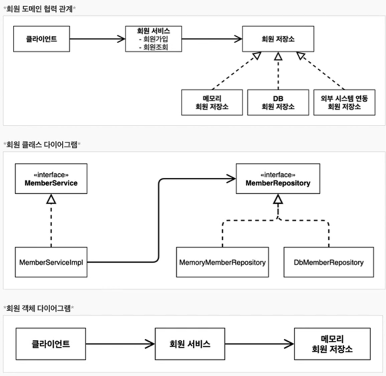

## 회원 도메인 개발
* 모델 생성
```
package hello.core.member;

public class Member {

    private Long id;
    private String name;
    private Grade grade;

    public Member(Long id, String name, Grade grade) {
        this.id = id;
        this.name = name;
        this.grade = grade;
    }

    public Long getId() {
        return id;
    }

    public void setId(Long id) {
        this.id = id;
    }

    public String getName() {
        return name;
    }

    public void setName(String name) {
        this.name = name;
    }

    public Grade getGrade() {
        return grade;
    }

    public void setGrade(Grade grade) {
        this.grade = grade;
    }
}

```
```
package hello.core.member;

public enum Grade {
    BASIC,
    VIP,
    ;
}

```

* 서비스 
```
package hello.core.member;

public interface MemberService {

    void join(Member member);

    Member findMember(Long memberId);
}

---------------------------------------------------------------
package hello.core.member;

public class MemberServiceImpl implements MemberService {

    private final MemberRepository memberRepository = new MemoryMemberRepository();

    @Override
    public void join(Member member) {
        memberRepository.save(member);
    }

    @Override
    public Member findMember(Long memberId) {
        return memberRepository.findById(memberId);
    }
}

```
* 레포지토리 
```
package hello.core.member;

public interface MemberRepository {

    void save(Member member);

    Member findById(Long memberId);
}
-----------------------------------------------------------------
package hello.core.member;

import java.util.HashMap;
import java.util.Map;

public class MemoryMemberRepository implements MemberRepository {

    /**
     * 동시성 이슈로 원래는 ConcurrentHashMap을 써야한다.
     */
    private static Map<Long, Member> store = new HashMap<>();

    @Override
    public void save(Member member) {
        store.put(member.getId(), member);
    }

    @Override
    public Member findById(Long memberId) {
        return store.get(memberId);
    }
}

```

## 회원 도메인 실행과 테스트
* 서비스 테스트 생성
```
package hello.core.member;

import org.junit.jupiter.api.Assertions;
import org.junit.jupiter.api.Test;

public class MemberServiceTest {

    MemberService memberService = new MemberServiceImpl();

    @Test
    void join() {
        //given
        Member member = new Member(1L, "A", Grade.VIP);

        //when
        memberService.join(member);
        Member findMember = memberService.findMember(1L);

        //then
        Assertions.assertEquals(member, findMember);
    }
}

```
* 질문 사항
  * 이 코드의 설계상 문제점은 무엇일까요?
  * 다른 저장소로 변경할 때 OCP 원칙을 잘 준수 할 수 있을까요?
  * DIP를 잘 지키고 있을까요?
  * 의존관계가 인터페이스 뿐만 아니라 구현까지 모두 의존하는 문제점이 있음
    * 주문까지 만들고나서 문제점과 해결 방안을 설정


## 주문과 할인 도메인 설계
* 주문과 할인 정택
  * 회원은 상품을 주문할 수 있다.
  * 회원 등급에 따라 할인 정책을 적용 할 수 있다.
  * 할인 정택은 모든 VIP는 1000원을 할인해주는 고정 금액 할인을 적용해달라. (나중에 변경 될 수 있다.)
  * 할인 정택은 변경 가능성이 높다. 회사의 기본 할인 정책을 아직 정하지 못했고, 오픈 직전까지 고민을 미루고 싶다. 최악의 경우 할인을 적용하지 않을 수도 있다. (미확정)
  * (이미지)
  
1. 주문 생성 : 클라이언트는 주문 서비스에 주문 생생을 한다.
2. 회원 조회 : 할인을 위해서는 회원 등급이 필요하다. 그래서 주문 서비스는 회원 저장소에서 회원을 조회한다.
3. 할인 적용 : 주문 서비스는 회원 등급에 따른 할인 여부를 할인 정택에 위임한다.
4. 주문 결과 반환 : 주문 서비스는 할인 결과를 포함한 주문 결과를 반환한다.
> 참고 : 실제로는 주문 데이터를 DB에 저장하지만, 예제가 너무 복잡해 질 수 있어서 생략하고, 단순히 주문 결과를 반환한다.

(이미지)

역활과 구현을 분리해서 자유롭게 구현체를 조립할 수 있게 설계했다. 덕분에 회원 저장소를 물론이고, 할인 정택도 유연하게 변경할 수 있다.

* 주문 도메인 객체 다이러그램1
  * 클라이언트
    * -> 주문 서비스 구현체
      * -> 메모리 회원 저장소
      * -> 정액 할인 정책

회원을 메모리에서 조회하고, 정액 할인 정택(고정 금액)을 지원해도 주문 서비스를 변경하지 않아도 된다.
역확들을 협력 관계를 그대로 재사용할 수 있다.

* 주문 도메인 객체 다이러그램2
  * 클라이언트
    * -> 주문 서비스 구현체
      * -> DB 회원 저장소
      * -> 정액 할인 정책

회원을 메모리가 아닌 실제 DB에서 조회하고, 정률 할인 정택(주문 금액에 따라 & 할인)을 지원해도 주문 서비스를 변경하지 않아도 된다.
협력 관계를 그대로 재사용할 수 있다.

## 주문과 할인 도메인 개발
* 주문 모델
```
package hello.core.order;

public class Order {

    private Long memberId;
    private String itemName;
    private int itemPrice;
    private int discountPrice;

    public Order(Long memberId, String itemName, int itemPrice, int discountPrice) {
        this.memberId = memberId;
        this.itemName = itemName;
        this.itemPrice = itemPrice;
        this.discountPrice = discountPrice;
    }

    public int calculatePrice() {
        return itemPrice - discountPrice;
    }

    public Long getMemberId() {
        return memberId;
    }

    public void setMemberId(Long memberId) {
        this.memberId = memberId;
    }

    public String getItemName() {
        return itemName;
    }

    public void setItemName(String itemName) {
        this.itemName = itemName;
    }

    public int getItemPrice() {
        return itemPrice;
    }

    public void setItemPrice(int itemPrice) {
        this.itemPrice = itemPrice;
    }

    public int getDiscountPrice() {
        return discountPrice;
    }

    public void setDiscountPrice(int discountPrice) {
        this.discountPrice = discountPrice;
    }

    @Override
    public String toString() {
        return "Order{" +
                "memberId=" + memberId +
                ", itemName='" + itemName + '\'' +
                ", itemPrice=" + itemPrice +
                ", discountPrice=" + discountPrice +
                '}';
    }
}

```

* 주문 서비스
```
package hello.core.order;

public interface OrderService {
    
    Order createOrder(Long memberId, String itemName, int itemPlace);
}

----------------------------------------------------------------------
package hello.core.order;

import hello.core.discount.DiscountPolicy;
import hello.core.discount.FixDiscountPolicy;
import hello.core.member.Member;
import hello.core.member.MemberRepository;
import hello.core.member.MemoryMemberRepository;

public class OrderServiceImpl implements OrderService {
    
    private final MemberRepository memberRepository = new MemoryMemberRepository();
    private final DiscountPolicy discountPolicy = new FixDiscountPolicy();
    
    @Override
    public Order createOrder(Long memberId, String itemName, int itemPlace) {
        
        Member member = memberRepository.findById(memberId);
        int discountPrice = discountPolicy.discount(member, itemPlace);
        
        return new Order(memberId, itemName, itemPlace, discountPrice);
    }
}

```

* 할인 정책 비니지스
```
package hello.core.discount;

import hello.core.member.Member;

public interface DiscountPolicy {

    int discount(Member member, int price);
}
------------------------------------------------------------------------
package hello.core.discount;

import hello.core.member.Grade;
import hello.core.member.Member;

public class FixDiscountPolicy implements DiscountPolicy {

    private int discountFicAmount = 1000;

    @Override
    public int discount(Member member, int price) {
        if (member.getGrade() == Grade.VIP) {
            return discountFicAmount;
        } else {
            return 0;
        }
    }
}
```

## 주문과 할인 도메인 실행과 테스트
```
package hello.core.order;

import hello.core.discount.DiscountPolicy;
import hello.core.discount.FixDiscountPolicy;
import hello.core.member.Member;
import hello.core.member.MemberRepository;
import hello.core.member.MemoryMemberRepository;

public class OrderServiceImpl implements OrderService {

    private final MemberRepository memberRepository = new MemoryMemberRepository();
    private final DiscountPolicy discountPolicy = new FixDiscountPolicy();

    @Override
    public Order createOrder(Long memberId, String itemName, int itemPlace) {

        Member member = memberRepository.findById(memberId);
        int discountPrice = discountPolicy.discount(member, itemPlace);

        return new Order(memberId, itemName, itemPlace, discountPrice);
    }
}

```

# 3. 스프링 핵심 원리 이해2 = 객체 지향 원리 적용

## 새로운 할인 정책 개발
* VIP는 퍼센트형태로 할인하는 로직 추가
```
package hello.core.discount;

import hello.core.member.Grade;
import hello.core.member.Member;

public class RateDiscountPolicy implements DiscountPolicy {

    private int discountPercent = 10;

    @Override
    public int discount(Member member, int price) {
        if (member.getGrade() == Grade.VIP) {
            return price * discountPercent / 100;
        } else {
            return 0;
        }
    }
}

```

* 테스트 추가
```
package hello.core.discount;

import hello.core.member.Grade;
import hello.core.member.Member;
import org.junit.jupiter.api.Assertions;
import org.junit.jupiter.api.DisplayName;
import org.junit.jupiter.api.Test;

class RateDiscountPolicyTest {

    RateDiscountPolicy discountPolicy = new RateDiscountPolicy();

    @Test
    @DisplayName("VIP는 10% 할인이 적용되어야 한다.")
    void vip_o() {
        //given
        Member member = new Member(1L, "memberVIP", Grade.VIP);
        //when
        int discount = discountPolicy.discount(member, 10000);
        //then
        Assertions.assertEquals(1000, discount);
    }

    @Test
    @DisplayName("VIP가 아니면 할인이 적용되지 않아야 한다.")
    void vip_x() {
        //given
        Member member = new Member(2L, "memberBASIC", Grade.BASIC);
        //when
        int discount = discountPolicy.discount(member, 10000);
        //then
        Assertions.assertEquals(0, discount);
    }
}
```

## 새로운 할인 정택 적용과 문제점
방금 추가한 할인 정택을 적용해보자

* 할인 정택을 애플리케이션에 적용해보자
  * 할인 정책을 변경하려면 클라이언트인 `OrderServiceImpl` 코드를 고쳐야 한다.
* 문제점 발견!!
  * 우리는 역활과 구현을 충실하게 분리했다. -> OK
  * 다형성도 활용하고, 인터페이스와 구현 객체를 분리했다 -> OK
  * OCP, CIP같은 객체지향 설계 원칙을 충실히 준수 했다
    * 그렇게 보이지만 사실은 아니다
  * DIP 주문 서비스 클라이언트 `OrderServiceImpl`은 `DiscountPolicy` 인터페이스에 의존하면서 DIP를 지킨 것같은데?
    * 클래스 의존과계를 분석해보자, 추상뿐만 아니라 구현 클래스에도 의존하고 있다.
      * 추상 의존 `DiscountPolicy`
      * 구현 클래스 `FixDiscountPolicy`, `RateDiscountPolicy`
  * OCP 변경하지 않고 확장할 수 있다고 했는데!?
    * 지금 코드는 기능을 확장해서 변경하면, 클라이언트 코드에 영향을 준다 따라서 OCP를 위반하고 있다.

문제점들을 잘 생각해보고 해결해나갈 방법을 생각해 보고 
다음시간에 답을 구해 보자!!

## 잠깐!!
애자일 소프트웨어 개발 선언문을 읽고 가자!

우리는 소프트웨어를 개발하고, 또 다른 사람의 개발을 도와주면서 소프트웨어 개발의 더 나은 방법들을 찾아가고 있다.
이작업을 통해 우리는 다음을 가지 있게 여기게 되었습니다.

공정과 도구보다 "개인과 상호작용" 을 포괄적인 문서보다 "작동하는 소프트웨어"를 꼐약 협상보다 "고객과의 협력"을 계획을 따르기보다 "변화에 대응하기"를
가지 있게 여긴다. 이 말은, 왼쪽에 있는 것들도 가치가 있지만, 우리는 오른쪽에 있는것들에 더 높은 가치를 둔다는 것이다.

## 관심사의 분리
* AppConfig를 통해서 관심사를 확실하게 분리했다.
* 배역, 배우를 생각해보자
* AppConfig는 공연 기획자다.
* AppConfig는 구체 클래스를 선택한다. 배역에 맞는 담당 배우를 선택한다, 애플리케이션이 어떻게 동작해야 할지 전체 구성을 책임진다.
* 이제 각 배우들은 담당 기능을 실행하는 책임만 지면 된다.
* orderServiceImpl 은 기능을 실행하는 책임만 지면 된다.


## AppCopnfig 리팩토링
현재 중복이 있고, 역활에 따른 구련이 잘 안보인다.
리팩터링 후
```
public class AppConfig {

    public MemberService memberService() {
        return new MemberServiceImpl(memberRepository());
    }

    private MemoryMemberRepository memberRepository() {
        return new MemoryMemberRepository();
    }

    public OrderService orderService() {
        return new OrderServiceImpl(memberRepository(), discountPolicy());
    }

    private FixDiscountPolicy discountPolicy() {
        return new FixDiscountPolicy();
    }
}
```


## 새로운 구조와 할인 정책 적용
* 처음으로 돌아가서 정책 할인 정책을 정률% 할인 정책으로 변경해보자
* FixDiscountPolicy -> RateDiscountPolicy
* 어떤 부분만 변경하면 되겠는가?

* AppConfig의 등장으로 애플리케이션이 크게 사용 영역과, 객체를 생성하고 구성하는 영역으로 분리되었다.

## 좋은 객체 지향 설계의 5가지 원칙의 적용
여기서 3가지 SRP, DIP, OCP 적용

SRP 단일 책임 원칙
한 클래스는 하나의 책임만 가져야 한다.

DIP 의존관계 역전 원칙
프로그래머는 “추상화에 의존해야지, 구체화에 의존하면 안된다.

OCP
소프트웨어 요소는 확장에는 열려 있으나 변경에는 닫여있어야 한다.
AppConfig가 의존관계를 FixDiscountPolicy > RateDiscountPolicy 로 변경해서 클라이언트 코드에 주입하므로 클라이언트 코드는 변경하지 않아도 됨
소프트웨어 요소를 새롭게 확장해도 사용 영역의 변경은 닫혀있다!!!

## IoC, DI, 그리고 컨테이너

### 제어의 역전
* 기존 프로그램은 클라이언트 구현 객체가 스스로 필요한 서버 구현 객체를 생성하고 , 연결하고, 실행했다. 한마디로 구현 객체가 프로그램의 제어 흐름을 스스로 조종했다. 개발자 입장에서는 자연스러운 흐름이다.
* 반면에 AppConfig가 등장한 이후에 구현 객체는 자신의 로직을 실행하는 역활만 담당한다. 프로그램의 제어 흐름은 이제 AppConfig가 가져단다. 예를 들어서 OrderServiceImple은 필요한 인터페이스들을 호출하지만 어떤 구현 객체들이 실행 될지 모른다.
* 프로그램에 대한 제어 흐름에 대한 권한은 모두 AppConfig가 가지고 잇다. 심지어 OrderServiceImpl도 AppConfig가 생성한다. 그리고 AppConfig는 OrderServiceImpl이 아닌 OrderService 인터페이스의 다른 구현 객체를 생성하고 실행할 수 도 있다. 그런 사실도 모른채 OrderServiceImpl은 묵묵히 자신의 로직을 실행할 뿐이다.
* 이렇듯 프로그램의 제어 흐름을 직접 제어하는 것이 아니라 외부에서 관리하는 것을 제어의 역전(IoC)이라 한다.

### 프레임워크 vs 라이브러리
* 프레임워크가 내가 작성한 코드를 제어하고, 대신 실행하면 그것은 프레임워크가 맞다
* 반면에 내가 작성한 코드가 직접 제어의 흐름을 담당한다면 그것은 프레임워크가 아니라 라이브러리다

### 의존관계 주입 DI
* OrderServiceImpl은 DiscountPolicy 인터페이스에 의존한다. 실제 어떤 구현 객체가 사용될지는 모른다.
* 의존관계는 “정적인 클래스 의존 관계와, 실행 시점에 결정되는 동적인 객체(인스턴스) 의존 관계” 둘을 분리해서 생각해야 한다.

### 정적인 클래스 의존관계
클래스가 사용하는 import 코드만 보고 의존관계를 쉽게 판단할 수 있다. 정적인 의존관계는 애플리케이션 실행하지 않아도 분석할 수 있다. 클래스 다이어그램을 보자 OrderServiceImpl은 MemberRepository, DiscountPolicy에 의존한다는 것을 알 수 있다.
그런데 이러한 클래스 의존관계 만으로는 실제 어떤 객체가 OrderServiceImpl에 주입 될 지 알 수 없다 
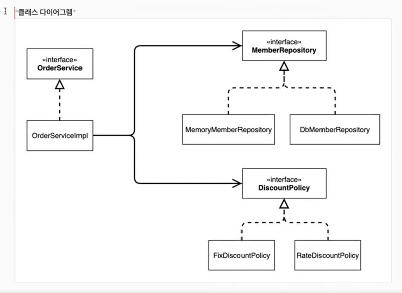

### 동적인 객체 인스턴스 의존 관계
애플리케이션 실행 시점에 실제 생성 된 객체 인스턴스의 참조가 연결된 의존관계다.

객체다이어그램  
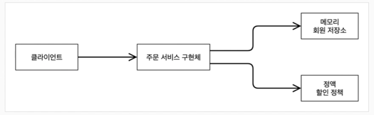

* 래플리케이션 “실행시점”에 외부에서 실제 구현 객체를 생성하고 클라이언트에 전달해서 클라이언트와 서버의 실제 의존관계가 연결 되는 것을 의존관계 주입이라 한다.
* 객체 인스턴스를 생성하고, 그 참조값을 전달해서 연결된다.
* 의존관계 주입을 사용하면 클라이언트 코드를 변경하지 않고, 클라이언트가 호출하는 대상의 타입 인스턴스를 변경할 수 있다.
* 의존관계 주입을 사용하면 정적인 클래스 의존관계를 변경하지 않고, 동적인 객체 인스턴스 의존관계를 쉽게 변경할 수 있다.

### IoC컨테이너, DI컨테이너
* AppConfig 처럼 객체를 생성하고 관리하면서 의존관계를 연결해 주는 것을
* IoC컨테이너 또는 DI컨테이너라 한다.
* 의존관계 주입에 초점을 맞추어 최근에는 주로 DI 컨테이너라 한다.
* 또는 어셈블러, 오브젝트 팩토리 등으로 불리기도 한다.

## 스프링빈 사용
@Configuration과
각 @Bean을 선언하면 스프링 컨테이너에 등록하게 된다.
```
@Configuration
public class AppConfig {

    @Bean
    public MemberService memberService() {
        return new MemberServiceImpl(memberRepository());
    }

    @Bean
    public MemoryMemberRepository memberRepository() {
        return new MemoryMemberRepository();
    }

    @Bean
    public OrderService orderService() {
        return new OrderServiceImpl(memberRepository(), discountPolicy());
    }

    @Bean
    public FixDiscountPolicy discountPolicy() {
        return new FixDiscountPolicy();
    }
}
```

스프링컨테이너는 ApplicationContext에 모두 관리된다.
ApplicationContext applicationContext = new AnnotationConfigApplicationContext(AppConfig.class);

등록 된 컨피그 클래스를 선언하고
getBean을 통해서 원하는 객체를 꺼내와서 사용할 수 있다.
```
public class MemberApp {
    public static void main(String[] args) {

//        AppConfig appConfig = new AppConfig();
//        MemberService memberService = appConfig.memberService();
        ApplicationContext applicationContext = new AnnotationConfigApplicationContext(AppConfig.class);
        MemberService memberService = applicationContext.getBean("memberService", MemberService.class);
        Member member = new Member(1L, "memnerA", Grade.VIP);
        memberService.join(member);

        Member findMember = memberService.findMember(1L);
        System.out.println("new member = " + member.getName());
        System.out.println("find member = " + findMember.getName());
    }
}
```
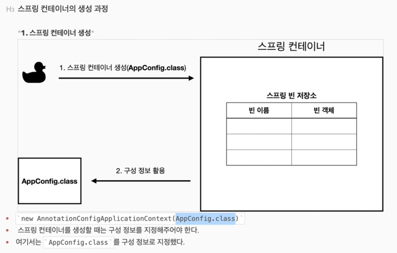
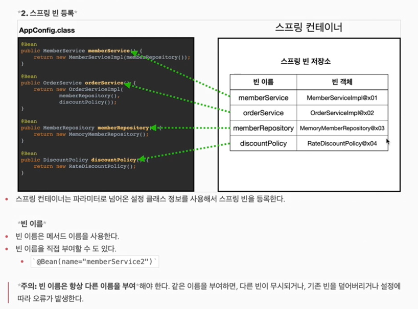


## 등록 된 모든 빈 조회해보기
```
public class ApplicationContextInfoTest {

    AnnotationConfigApplicationContext ac = new AnnotationConfigApplicationContext(AppConfig.class);

    @Test
    @DisplayName("모든 빈 출력하기")
    void findAllBean() {
        String[] beanDefinitionNames = ac.getBeanDefinitionNames();
        Arrays.stream(beanDefinitionNames).forEach(s -> {
            Object bean = ac.getBean(s);
            System.out.println("name = " + s + " object = " + bean );
        });
    }

    @Test
    @DisplayName("모든 빈 출력하기")
    void findApplicationBean() {
        String[] beanDefinitionNames = ac.getBeanDefinitionNames();
        Arrays.stream(beanDefinitionNames).forEach(s -> {
            BeanDefinition beanDefinition = ac.getBeanDefinition(s);
            if (beanDefinition.getRole() == BeanDefinition.ROLE_APPLICATION) {
                Object bean = ac.getBean(s);
                System.out.println("name = " + s + " object = " + bean );
            }
        });
    }
}
```
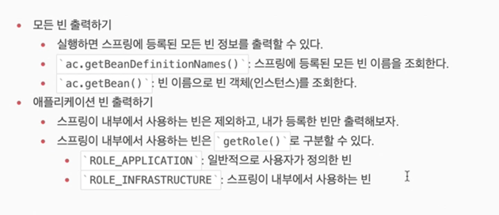


## 스프링빈 기본 조회
test기반으로 알아보자
```
public class ApplicationContextBasicFindTest {
    AnnotationConfigApplicationContext ac = new AnnotationConfigApplicationContext(AppConfig.class);

    @Test
    @DisplayName("빈 이름으로 조회")
    void findBeanName() {
        MemberService memberService = ac.getBean("memberService", MemberService.class);
        Assertions.assertThat(memberService).isInstanceOf(MemberServiceImpl.class);
    }

    @Test
    @DisplayName("이름 없이 타입으로만 조회")
    void findBeanType() {
        MemberService memberService = ac.getBean(MemberService.class);
        Assertions.assertThat(memberService).isInstanceOf(MemberServiceImpl.class);
    }

    @Test
    @DisplayName("구체 타입으로 조회")
    void findBeanName2() {
        MemberServiceImpl memberService = ac.getBean(MemberServiceImpl.class);
        Assertions.assertThat(memberService).isInstanceOf(MemberServiceImpl.class);
    }

    @Test
    @DisplayName("빈 이름으로 조회X")
    void findBeanNameX() {
//        MemberService xxxx = ac.getBean("xxxx", MemberService.class);
        org.junit.jupiter.api.Assertions.assertThrows(NoSuchBeanDefinitionException.class,
                () -> ac.getBean("xxxx", MemberService.class));
    }
}
```

## 스프링 빈 조회 - 동일한 타입이 둘 이상

```
public class ApplicationContextBasicSameFindTest {
    AnnotationConfigApplicationContext ac = new AnnotationConfigApplicationContext(SameBeanConfig.class);

    @Test
    @DisplayName("타입으로 조회시 같은 타입이 둘 이상 있으면, 중복 오류가 발생한다.")
    void findBeanTypeDuplicate() {
//        MemberRepository memberRepository = ac.getBean(MemberRepository.class);
        Assertions.assertThrows(NoUniqueBeanDefinitionException.class,
                () -> ac.getBean(MemberRepository.class));
    }

    @Test
    @DisplayName("타입으로 조회시 같은 타입이 둘 이상 있으면, 빈 이름을 지정하면 된다.")
    void findBeanName() {
        MemberRepository memberRepository = ac.getBean("memberRepository1", MemberRepository.class);
        org.assertj.core.api.Assertions.assertThat(memberRepository).isInstanceOf(MemberRepository.class);
//        Assertions.assertThrows(NoUniqueBeanDefinitionException.class,
//                () -> ac.getBean("memberRepository1", MemberRepository.class));
    }

    @Test
    @DisplayName("특정 타입을 모두 조회하기")
    void findAllBeanType() {
        Map<String, MemberRepository> beansOfType = ac.getBeansOfType(MemberRepository.class);

        for (String key : beansOfType.keySet()) {
            System.out.println("key = " + key + " value = " + beansOfType.get(key));
        }
        System.out.println("beasOfType = " + beansOfType);
        org.assertj.core.api.Assertions.assertThat(beansOfType.size()).isEqualTo(2);
    }

    @Configuration
    static class SameBeanConfig {

        @Bean
        public MemberRepository memberRepository1() {
            return new MemoryMemberRepository();
        }

        @Bean
        public MemberRepository memberRepository2() {
            return new MemoryMemberRepository();
        }
    }
}

```


## 스프링 빈 조회 - 상속관계

자식 타입은 다 조회된다.  
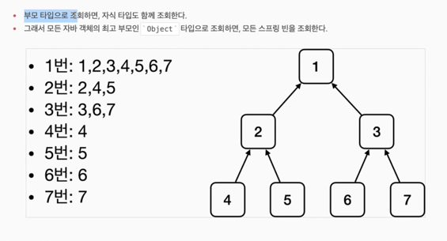

```
public class ApplicationContextExtentsFindTest {
    AnnotationConfigApplicationContext ac = new AnnotationConfigApplicationContext(TestConfig.class);


    @Test
    @DisplayName("부모 타입으로 조회 시, 자식이 둘 이상있으면, 중복 오류가 발생한다.")
    void findBeanByParentTypeDuplicate() {
        Assertions.assertThrows(NoUniqueBeanDefinitionException.class,
                () -> ac.getBean(DiscountPolicy.class));
    }

    @Test
    @DisplayName("부모 타입으로 조회 시, 자식이 둘 이상있으면, 빈 이름을 지정하면 된다.")
    void findBeanByName() {
        DiscountPolicy rateDiscountPolicy = ac.getBean("rateDiscountPolicy", DiscountPolicy.class);
        org.assertj.core.api.Assertions.assertThat(rateDiscountPolicy).isInstanceOf(RateDiscountPolicy.class);
    }

    @Test
    @DisplayName("부모 타입으로 조회 시, 자식이 둘 이상있으면, 타입으로 지정하면 된다.")
    void findBeanByType() {
        RateDiscountPolicy rateDiscountPolicy = ac.getBean(RateDiscountPolicy.class);
        org.assertj.core.api.Assertions.assertThat(rateDiscountPolicy).isInstanceOf(RateDiscountPolicy.class);
    }

    @Test
    @DisplayName("부모 타입으로 모두 조회하기")
    void findAllBeanByParentType() {
        Map<String, DiscountPolicy> beansOfType = ac.getBeansOfType(DiscountPolicy.class);

        for (String key : beansOfType.keySet()) {
            System.out.println("key = " + key + " value = " + beansOfType.get(key));
        }
        System.out.println("beasOfType = " + beansOfType);
        org.assertj.core.api.Assertions.assertThat(beansOfType.size()).isEqualTo(2);
    }

    @Test
    @DisplayName("오브젝트 타입으로 모두 조회하기")
    void findAllBeanByObjectType() {
        Map<String, Object> beansOfType = ac.getBeansOfType(Object.class);

        for (String key : beansOfType.keySet()) {
            System.out.println("key = " + key + " value = " + beansOfType.get(key));
        }
        System.out.println("beasOfType = " + beansOfType);
    }

    @Configuration
    static class TestConfig {

        @Bean
        public DiscountPolicy rateDiscountPolicy() {
            return new RateDiscountPolicy();
        }

        @Bean
        public DiscountPolicy fixDiscountPolicy() {
            return new FixDiscountPolicy();
        }
    }
}

```

## BeanFactory와 ApplicationContext 관계
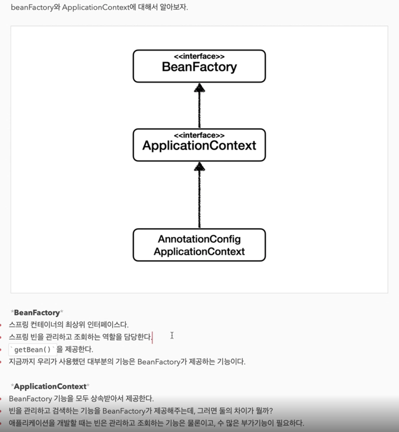
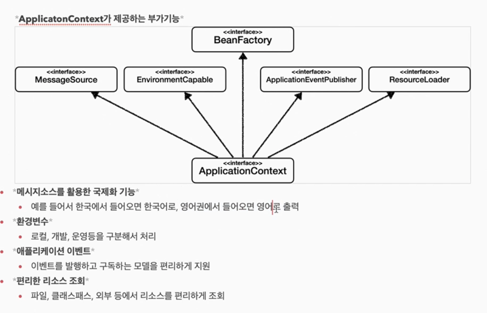


## 웹 어플리케이션과 싱글톤
* 스프링은 태성이 기업용 온라인 서비스 기술을 지원하기 위해 탄생
* 대부분의 스프링 애플리케이션은 웹 애플리케이션이다. 물론 웹이 아닌 다른 개발도 가능하다
* 웹은 보통 여러 고객이 동시에 요청을 한다.
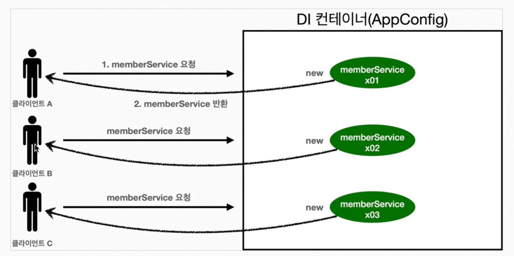
```
public class SingletonTest {

    @Test
    @DisplayName("스프링 없는 순수한 DI 컨테이너")
    void pureContainer() {
        AppConfig appConfig = new AppConfig();

        // 1 조회 호출할 때 마다 객체를 생성
        MemberService memberService1 = appConfig.memberService();

        // 2 조회 호출할 때 마다 객체를 생성
        MemberService memberService2 = appConfig.memberService();

        // 참조 값이 다른 것을 확인
        System.out.println("memberService1 : " + memberService1);
        System.out.println("memberService2 : " + memberService2);

        Assertions.assertThat(memberService1).isNotSameAs(memberService2);
    }
}
```

## 싱글톤 패턴
* 큰래스의 인스턴스가 딱 1개만 생성되는 것을 보장하는 디자인 패턴
* 그래서 객체를 2개이상 생성하지 못하도록 막는다
  * private 생성자를 사용해서 외부에서 임의로 new 키워드를 사용하지 못하도록 막을 수 있다.
```
private static final SingletonService instance = new SingletonService();

    public static SingletonService getInstance() {
        return instance;
    }

    private SingletonService() {
    }

    public void logic() {
        System.out.println("싱글톤 객체 로직 호출");
    }
```
* static영역에 인스턴스를 미리 1개 생성한다
* 해당 객체의 생성자를 private으로 선언하여 외부에서 new를 사용못하게 한다.
* getInstance 메소드를 통해서 해당 객체를 사용하게 유도 한다.  

테스트 검증
```
    @Test
    @DisplayName("싱글통 패턴을 적용한 객체 사용")
    void singletonServiceTest() {
        SingletonService singletonService1 = SingletonService.getInstance();
        SingletonService singletonService2 = SingletonService.getInstance();

        System.out.println("singletonService1 : " + singletonService1);
        System.out.println("singletonService2 : " + singletonService2);

        Assertions.assertThat(singletonService1).isSameAs(singletonService2);
    }
```
“싱글톤 패턴 문제점”
* 싱글톤 패턴을 구현하는 코드 자체가 많이 들어간다.
* 의존관계상 클라이언트가 구체 클래스에 의존한다 > DIP를 위반한다.
* 클라이언트가 구체 클래스에 의존해서 OCP원칙을 위반할 가능성이 높다.
* 테스트하기 어렵다
* 내부속성을 변경하거나 초기화 하기 어렵다
* private 생성자로 자식 클래스를 만들기 어렵다
* 결론적으로 유연성이 떨어진다.
* 안티패턴으로 불리기도 한다.


## 싱글톤 컨테이너

스프링 컨테이너는 싱글톤 패턴의 문제점을 해결하면서, 객체 인스턴스를 싱글통(1개만 생성)으로 관리한다.
지금까지 우리가 학습한 스프링 빈이 바로 싱글톤으로 관리되는 빈이다.

* 스프링 컨테이너는 싱글턴 패턴을 적용하지 않아도, 객체 인스턴스를 싱글톤으로 관리한다.
  * 이전에 설명한 컨테이너 생성 과정에서 @Bean으로 등록한 것들은 객체를 하나만 생성해서 관리한다.
* 스프링 컨테이너는 싱글톤 컨테이너 역활을 한다. 이렇게 싱글톤 객체를 생성하고 관리하는 기능을 싱글톤 레지스트리라 한다.
* 스프링 컨테이너의 이런 기능 덕분에 싱글턴 패턴의 모든 단점을 해결하면서 객체를 싱글톤으로 유지할 수 있다.
  * 싱글톤 패턴을 위한 지저분한 코드가 들어가지 않아도 된다.
  * DIP, OCP, 테스트, private 생성자로부터 자유롭게 싱글톤을 사용할 수 있다.
```
@Test
    @DisplayName("스프링 컨테이너와 싱글톤")
    void springContainer() {

        ApplicationContext ac = new AnnotationConfigApplicationContext(AppConfig.class);
        MemberService memberService1 = ac.getBean("memberService", MemberService.class);
        MemberService memberService2 = ac.getBean("memberService", MemberService.class);

        System.out.println("memberService1 : " + memberService1);
        System.out.println("memberService2 : " + memberService2);

        Assertions.assertThat(memberService1).isSameAs(memberService2);
    }
```
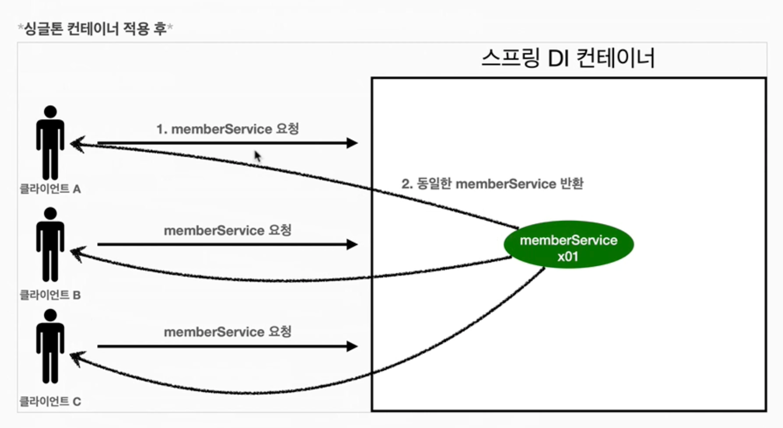


## 싱글톤 방식의 주의점
* 싱글톤 패턴이든, 스프링 같은 싱글톤 컨테이너를 사용하든, 객체 인스턴스를 하나만 생성해서 공유하는 싱글톤 방식은 여러 클라이언트가 하나의 같은 객체 인스턴스를 공유하기 때문에 싱글톤 객체는 상태를 유지하게 설계하면 안된다.
* 무상태(stateless)로 설계해야한다.
  * 특정 클라이언트에 의존적인 필드가 있으면 안된다
  * 특정 클라이언트가 값을 변경할 수 있는 필드가 있으면 안된다.
  * 가급적 읽기만 가능해야 한다.
  * 필드 대신에 자바에서 공유되지 않는, 지역변수, 파라미터, 쓰레드로컬등을 사용해야 한다.
* 스프링 빈의 필드에 공유 값을 설정하면 정말 큰 장애가 발생할 수 있다!!!

```
public class StatefulServiceTest {

    @Test
    @DisplayName("스프링 없는 순수한 DI 컨테이너")
    void pureContainer() {
        ApplicationContext ac = new AnnotationConfigApplicationContext(TestConfig.class);
        StatefulService statefulService1 = ac.getBean("statefulService", StatefulService.class);
        StatefulService statefulService2 = ac.getBean("statefulService", StatefulService.class);

        statefulService1.order("userA", 10000);
        statefulService2.order("userB", 20000);

        int price = statefulService1.getPrice();
        System.out.println("statefulService1 price = " + price);

        Assertions.assertThat(statefulService1.getPrice()).isEqualTo(20000);
    }

    static class TestConfig {
        @Bean
        public StatefulService statefulService() {
            return new StatefulService();
        }
    }
}

```
* 공유 변수를 가지고 싱글톤 로직에서 사용하게되면 테스트 코드와 같이 A사용자의 결과값이 10000이 나와야하는데 20000이 튀나오는 문제가 발생한다.
* 이런걸 절대적으로 조심해서 로직을 짜야한다.
* 멀티쓰레드 단위까지 가면 정말 복잡하고 문제점을 찾기가 너무 어렵다.


## @Configuration과 싱글톤 
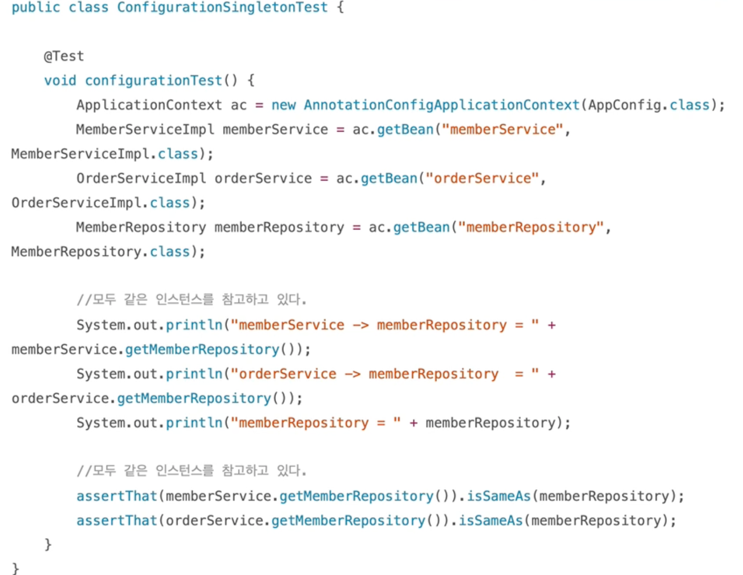  
테스트코드 결과를보면 스프링빈에서 호출한 MemberRepository는 의존된 타 객체에서도 모두 동일한 값으로 사용되고 있다.
MemberRepository 본인 주소도 모두 동일하다  
결론은 스프링이 빈으로 등록하는 과정에서 의존관계를 주입할 때 싱글톤을 유지하면서 주입을 해준다고 이해하면 될듯하다


## @Configuration과 바이트코드 조작의 마법
스프링 컨테이너는 싱글톤 레지스트리다. 따라서 스프링 빈이 싱글톤이 되도록 보장해주어야 한다. 그런데 스프링이 자바 코드까지 어떻게 하기는 어렵다.  
저 자바 코드를 보면 분명 3번 호출되어야하는 것이 맞다.  
그래서 스프링은 클래스의 바이트코드를 조작하는 라이브러리를 사용한다.  
모든 비밀은 @Configuration을 적용한 AppConfig에 있다.

다음 코드를 보자  
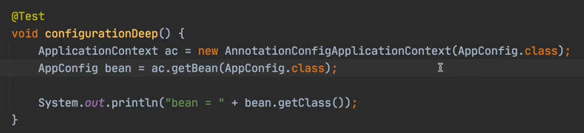

* 사실 AnnotationConfigApplicationContext에 파라미터로 넘긴 값은 스프링 빈으로 등록 된다. 그래서 AppConfig도 스프링 빈이 된다.
* AppConfig 스프링 빈을 조회해서 클래스 정보를 출력해보자  

순수한 클래스라면 다음과 같이 출력되어야 한다.  
  

그런데 예상과는 다르게 클래스 명예 xxxCGLIB가 붙으면서 상당히 복잡해진 것을 볼 수 있다. 이것은 내가 만든 클래스가 아니라 스프링이  
CGLIB라는 바이트코드 조작 라이브러리를 사용해서 AppConfig 클래스를 상속받은 임의의 다른 클래스를 만들고, 그 다른 클래스를 스프링 빈으로 등록한 것이다.  

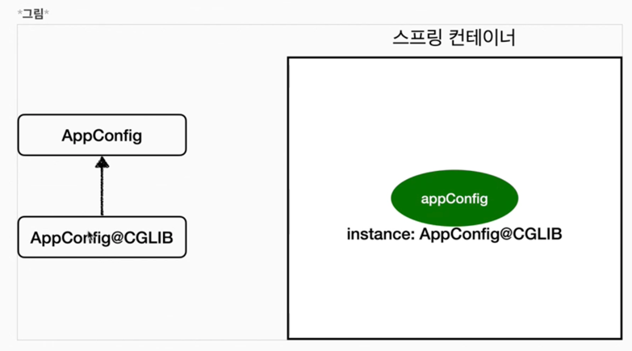  
그 임의의 다른 클래스가 바로 싱글톤이 보장되도록 해준다. 아마도 다음과 같이 바이트 코드를 조작해서 작성되어있을 것이다.

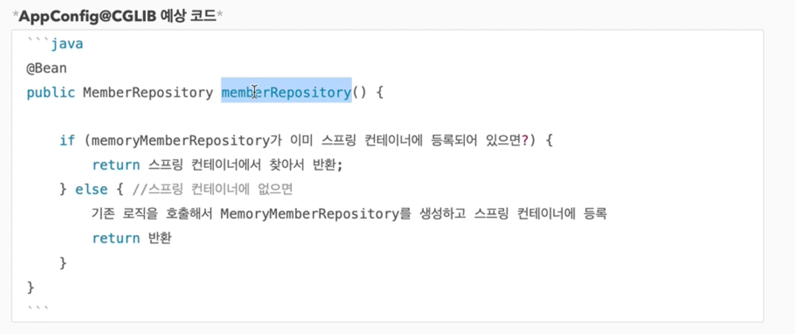  
* @Bean이 붙은 메서드마다 이미 스프링 빈이 존재하면 존재하느 빈을 반환하고, 스프링 빈이 없으면 생성해서 스프링 빈으로 등록하고 반환하는 코드가 동적으로 만들어진다.
* 덕분에 싱글톤이 보장되는 것이다.


# 컴포넌트 스캔

## 컴포넌트 스캔 적용하기
* 컴포넌트 스캔을 사용하려면 먼저 ‘@ComponentScan’을 설정 정보에 붙여주면 된다.
* 기존의 AppConfig와는 다르게 @Bean 어노테이션을 사용하지 않는다

# 참고
현 예제에서는 @Configuration을 사용하여 수동으로 @Bean주입을 한 AppConfig 코드가 존재하기 때문에
@ComponentScan 사용 시 중복되어 오류가 발생할 수 있는 부분을 예외처리 하기위해 ‘exloudeFilters’를 설정한다.

자 그럽 필요한 각 클래스 파일에 @Component 어노테이션을 붙이도록 하자
```
public class AutoAppConfigTest {

    @Test
    void basicScan() {
        AnnotationConfigApplicationContext ac = new AnnotationConfigReactiveWebApplicationContext(AutoAppConfig.class);

        MemberService memberService = ac.getBean(MemberService.class);
        Assertions.assertThat(memberService).isInstanceOf(MemberService.class);
    }
}
```
테스트 코드를 실행해보면 스캔 된 클래스 목록을 확인 할 수 있다.  
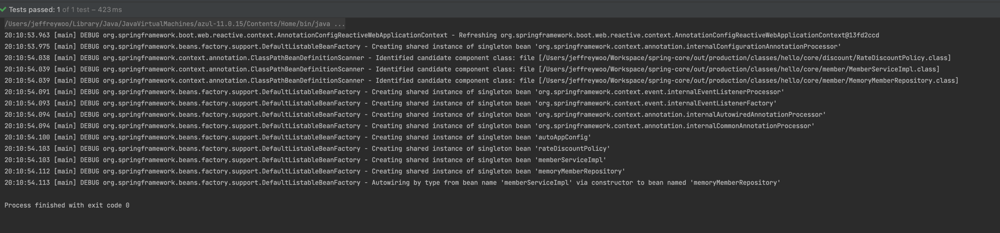


### @ComponentScan 이미지로 알아보기  
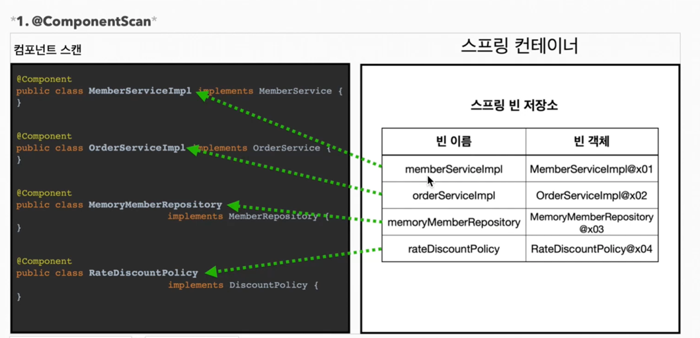  
* @ComponentScan은 @Component가 붙은 모든 클래스를 스프링빈으로 등록한다.
* 이때 스프링빈의 기본 이름은 클래스명을 사용하되 맨 앞글자만 소문자를 사용한다.
  * 빈 이름 기존 전략 : MemberServiceImpl > memberServiceImpl
  * 빈 이름 직접 지정 : 만약 스프링 빈의 이름을 직접 지정하고 싶으면 @Component(“memberServiceImpl”)로 이름을 부여하면 된다.
  

### @Autowired 의존관계 주입
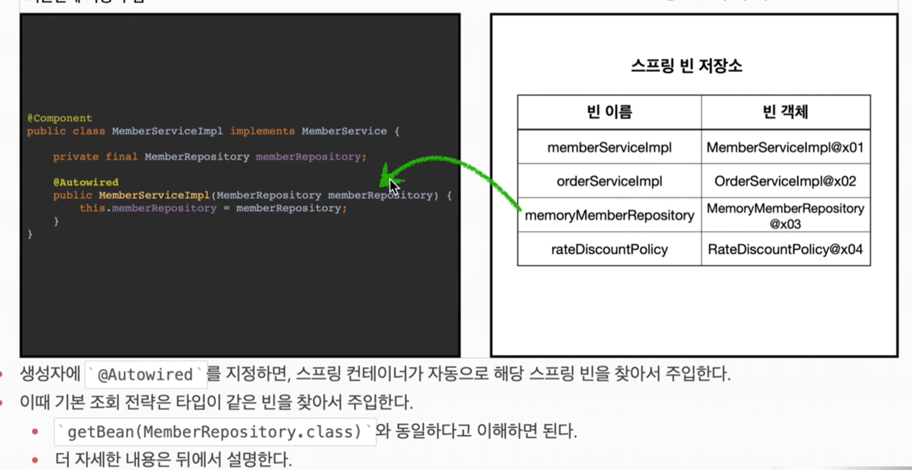

## 탐색 위치와 기본 스캔 대상
### 탐색할 패키지의 시작 위치 지정
모든 자바 클래스를 다 컴포넌트 스캔하면 시간이 오래 걸린다. 그래서 꼭 필요한 위치부터 탐색하도록 시작 위치를 지정할 수 있다.
* basePackages : 탐색할 패키지의 시작 위치를 지정한다. 이패키지를 포함해서 하위 패키지를 모두 탐색한다.
  * basePackages = {“hello.core”, “hello.service”} 이렇게 여러 시작 위치를 지정할 수 있다.
* basePackageClasses : 지정한 클래스의 패키지를 탐색 시작 위로 지정한다.
* 만약 지정하지 않으면 @ComponentScan이 붙은 설정 정보 클래스의 패키지가 시작 위치가 된다.

## 컴포넌트 스캔 기본 대상
컴포넌트 스캔은 @Component 뿐만 아니라 다음과 내용도 추가로 대상에 포함한다.
* @Component : 컴포넌트 스캔에서 사용
* @Controller : 스프링MVC 컨트롤러에서 사용
* @Service : 스프링 비즈니스 로직에서 사용
* @Repository : 스프링 데이터 접근 계층에서 사용
* @Configuration : 스프링 설정 정보에서 사용

해당 클래스의 소스 코드를 보면 @Component를 포함하고 있는 것을 알 수 있다.


## 커스텀 필터 
```
public class ComponentFilterAppTest {

    @Test
    void filterScan() {
        ApplicationContext ac = new AnnotationConfigApplicationContext(ComponentFilterAppConfig.class);
        BeanA beanA = ac.getBean("beanA", BeanA.class);
        Assertions.assertThat(beanA).isNotNull();

        org.junit.jupiter.api.Assertions.assertThrows(NoSuchBeanDefinitionException.class,
                () -> ac.getBean("beanB", BeanB.class));
    }

    @Configuration
    @ComponentScan(
            includeFilters = @ComponentScan.Filter(type = FilterType.ANNOTATION, classes = MyIncludeComponent.class),
            excludeFilters = @ComponentScan.Filter(type = FilterType.ANNOTATION, classes = MyExcludeComponent.class)
    )
    static class ComponentFilterAppConfig {
    }
}
```


### FilterType 옵션
* ANNOTATION : 기본값, 어노테이션을 인식해서 동작
* ASSIGNABLE_TYPE : 지정한 타입과 자식 타입을 인식해서 동작한다.
* ASPECTJ : AspectJ 패턴 사용
* REGEX : 정규 표현식
* CUSTOM : TypeFilter 이라는 인터페이스를 구현해서 처리


